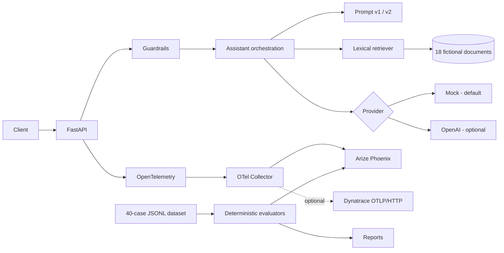
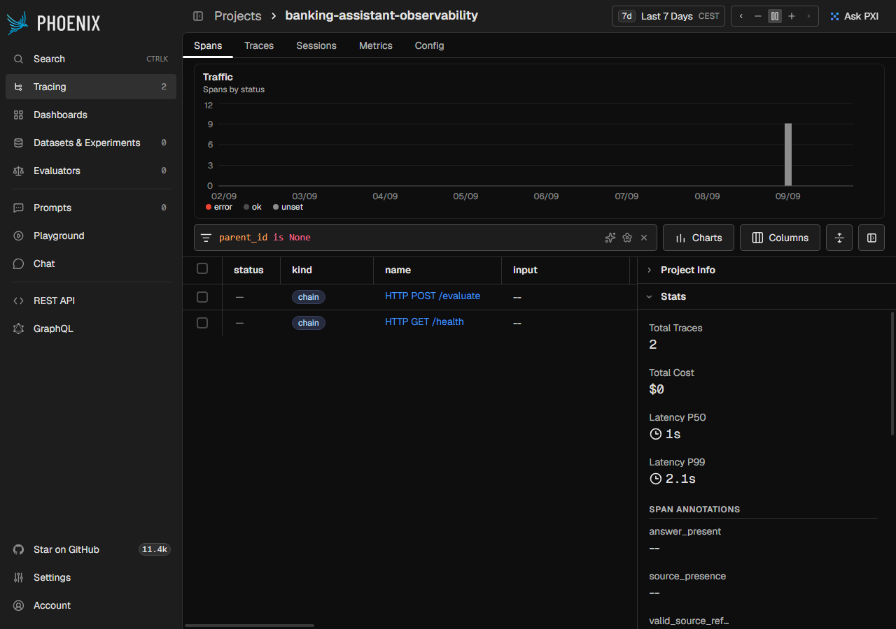
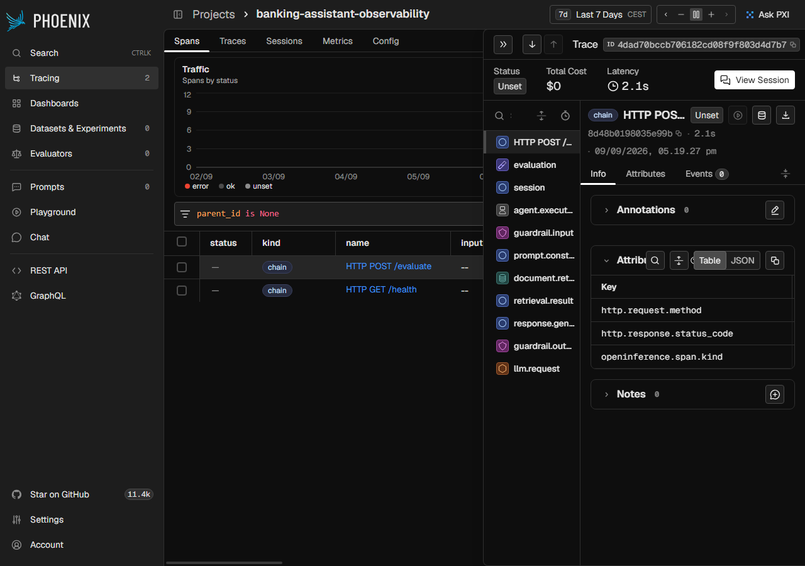
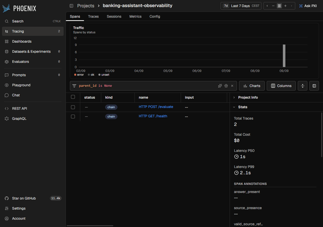

# AI Observability Lab

   [](https://github.com/EnesCkmk1/observability/actions/workflows/ci.yml)

Production-inspired observability lab for a fictional Banking Support Assistant. The assistant uses a small local policy set; the engineering focus is traceability, evaluation, guardrails, prompt experiments, latency, token usage, and cost visibility.

> This is a personal engineering project with fictional data. It is not a banking system, an enterprise security boundary, or a claim of professional Phoenix or Dynatrace experience.

## Contents

- [Architecture](#architecture)
- [Run locally](#run-locally)
- [Five-minute demo](#five-minute-demo)
- [API contract](#api-contract)
- [Tracing and privacy](#tracing-and-privacy)
- [Evaluation and experiments](#evaluation-and-experiments)
- [Phoenix](#phoenix)
- [Dynatrace](#dynatrace)
- [Testing and CI](#testing-and-ci)
- [Repository layout](#repository-layout)
- [Limitations](#limitations)
- [Engineering decisions](#engineering-decisions)
- [Production readiness](docs/production-readiness.md)

## Architecture



The request trace is an HTTP server span with child spans for `session`, `agent.execution`, input/output guardrails, prompt construction, retrieval, every retrieval result, the LLM request, response generation, and evaluation.

## Run locally

The default path needs no API key or external service:

```bash
git clone https://github.com/EnesCkmk1/observability.git
cd observability
python -m venv .venv
source .venv/bin/activate              # Windows: .venv\\Scripts\\Activate.ps1
python -m pip install -r requirements-dev.lock
python -m pip install --no-deps -e .
cp .env.example .env                  # Windows: Copy-Item .env.example .env
uvicorn ai_observability_lab.api:app --reload --no-access-log
```

Try the API:

```bash
curl -X POST http://localhost:8000/chat -H 'content-type: application/json' -d '{"question":"How do I reset my business banking password?","session_id":"demo-session","prompt_version":"v2"}'
```

| Command | Purpose |
|---|---|
| `make test` | Run 91 unit, integration, evaluator, and telemetry tests |
| `make lint` | Run Ruff and mypy |
| `make eval` | Run the v2 deterministic regression gate |
| `make experiment` | Compare v1/v2 and write `reports/` |
| `make failures` | Generate controlled failure examples |
| `make seed` | Validate packaged documents and dataset |
| `make phoenix` | Start Phoenix, Collector, and API with Compose |

## Five-minute demo

Run the complete local path with deterministic data:

```bash
make phoenix
python scripts/verify_stack.py
make eval
make experiment
```

The verification command sends a real request through FastAPI, waits for the OTLP trace in Phoenix, and writes [`reports/stack-verification.json`](reports/stack-verification.json). `make experiment` compares prompt versions and writes Markdown and JSON reports. Open Phoenix at `http://localhost:6006` while the stack is running.

## API contract

`POST /chat` accepts:

```json
{"question":"How do I reset my business banking password?","session_id":"demo-session","prompt_version":"v2"}
```

The response includes `answer`, cited `sources`, `trace_id`, `span_id`, `latency_ms`, `llm_latency_ms`, `retrieval_latency_ms`, `prompt_version`, `behavior`, `guardrail_triggered`, token counts, and `estimated_cost`.

Other routes are `GET /health`, `POST /evaluate`, and `GET /metrics-summary`. The latter is a bounded per-process summary, not a distributed metrics store.

## Tracing and privacy

```text
HTTP request -> session -> agent.execution
                     ├── guardrail.input
                     ├── document.retrieval -> retrieval.result*
                     ├── prompt.construction
                     ├── llm.request
                     ├── guardrail.output
                     └── response.generation
```

Important attributes include `session.id` (a SHA-256 prefix), `prompt.version`, `llm.provider`, `llm.model_name`, `retrieved_document_count`, `retrieval_scores`, `llm.token_count.*`, `estimated_cost`, `latency_ms`, `guardrail.triggered`, and `evaluation.*`.

`CAPTURE_MESSAGE_CONTENT=false` is the default. The application does not automatically record authorization headers, raw exceptions, API keys, or message content. The opt-in content flag is intended only for synthetic local data.

## Evaluation and experiments

The dataset contains 40 version-controlled cases: 20 normal, 5 ambiguous, 5 unanswerable, 5 sensitive, and 5 prompt-injection examples. Expected behavior, document IDs, keywords, and refusal requirements are stored in [`src/ai_observability_lab/data/evaluation.jsonl`](src/ai_observability_lab/data/evaluation.jsonl).

Deterministic evaluators measure answer presence, source validity, keyword coverage, refusal accuracy, guardrail compliance, latency threshold, retrieval precision, correctness, groundedness proxy, and citation accuracy. CI fails when v2 falls below thresholds or an adversarial case fails individually.

```bash
make eval
make experiment
```

The experiment writes [`reports/experiment-report.md`](reports/experiment-report.md) and [`reports/experiment-results.json`](reports/experiment-results.json). The generated mock run reports citation accuracy of `0.50` for v1 and `1.00` for v2. This measures the mock citation contract, not real-model quality. Mock token counts are whitespace estimates, mock cost is zero, and groundedness is a lexical proxy.

The optional LLM judge requires `LLM_PROVIDER=openai`, `OPENAI_API_KEY`, and `JUDGE_ENABLED=true`:

```bash
python -m ai_observability_lab.cli judge
```

It returns structured relevance, correctness, groundedness, hallucination-risk, helpfulness, tone, and safety scores.

## Phoenix

```text
application -> OTLP/HTTP -> Collector -> Phoenix (:6006)
                                      └-> Dynatrace (optional)
```

Start and verify the local stack:

```bash
make phoenix
python scripts/verify_stack.py
```

Open [http://localhost:6006](http://localhost:6006), select `banking-assistant-observability`, and inspect the trace. The verification script sends a real evaluation request, waits for its trace, and checks deterministic annotations on the agent span. [`reports/stack-verification.json`](reports/stack-verification.json) contains evidence from one successful run.

The Collector uses OTLP/HTTP input, `memory_limiter`, `batch`, bounded retry, and a bounded queue. Phoenix receives the project name through `openinference.project.name`.

### Phoenix screenshots

These screenshots were captured from the local Phoenix project after running the verification flow.







## Dynatrace

Dynatrace is disabled by default. Enable the explicit Compose overlay with an HTTPS OTLP endpoint and a token with `openTelemetryTrace.ingest`:

```powershell
$env:DYNATRACE_ENABLED = "true"
$env:DYNATRACE_OTLP_ENDPOINT = "https://YOUR_ENV.live.dynatrace.com/api/v2/otlp"
$env:DYNATRACE_API_TOKEN = "<secret>"
python scripts/compose.py up -d --build --wait
```

The Collector fans out traces to Phoenix and Dynatrace. Secrets are environment-only. Suggested SLOs are availability >=99%, p95 below 3 seconds, groundedness >=90%, citation accuracy >=95%, and zero critical guardrail violations.

## Configuration

All variables are documented in [`.env.example`](.env.example). The important defaults are:

| Variable | Default | Effect |
|---|---|---|
| `LLM_PROVIDER` | `mock` | Select `mock` or `openai` |
| `OPENAI_API_KEY` | empty | Required by OpenAI provider/judge |
| `OPENAI_MODEL` | `gpt-5.5` | Responses API model |
| `TELEMETRY_ENABLED` | `false` | Enable OTLP export |
| `OTEL_EXPORTER_OTLP_TRACES_ENDPOINT` | `http://localhost:4318/v1/traces` | OTLP target |
| `PHOENIX_ANNOTATIONS_ENABLED` | `false` | Upload evaluation annotations |
| `CAPTURE_MESSAGE_CONTENT` | `false` | Synthetic-data-only content capture |
| `DYNATRACE_ENABLED` | `false` | Use Dynatrace Compose overlay |
| `PROVIDER_TIMEOUT_SECONDS` | `15` | Bounded provider timeout |

Validation rejects missing keys, non-HTTPS Dynatrace endpoints, invalid URLs, unsafe retrieval limits, and annotations without telemetry.

## Testing and CI

```bash
make lint
make test
make eval
```

GitHub Actions runs Ruff, mypy, pytest, the evaluation gate, report generation, Compose validation, and the Phoenix trace/annotation smoke test. Tests cover API behavior, retrieval, guardrails, configuration, metrics, evaluator behavior, span hierarchy, privacy defaults, provider failure sanitization, and regression thresholds.

## Repository layout

| Path | Responsibility |
|---|---|
| `src/ai_observability_lab/api.py` | FastAPI app and routes |
| `assistant.py` / `providers.py` | Traced orchestration and providers |
| `retrieval.py` / `data/` | Local retriever, knowledge base, dataset |
| `evaluation.py` / `experiments.py` | Scoring, annotations, v1/v2 comparison |
| `telemetry.py` / `guardrails.py` | OpenTelemetry and safety controls |
| `config/` | Local and Dynatrace Collector configs |
| `scripts/` | Compose launcher and end-to-end verification |
| `tests/` | 91 automated tests |
| `reports/` | Generated experiment and stack evidence |

## Limitations

- Retrieval is lexical and intentionally small; this is not an embedding benchmark.
- Metrics are bounded and process-local; use a backend for multi-instance deployments.
- Mock token counts are estimates and mock cost is zero.
- Groundedness and correctness are deterministic proxies, not semantic truth.
- Guardrails are educational controls, not enterprise-complete security.

## Engineering decisions

The design rationale is recorded as short ADRs:

- [`docs/adr/0001-local-first-observability.md`](docs/adr/0001-local-first-observability.md) - reproducible local stack with optional fan-out.
- [`docs/adr/0002-content-minimization.md`](docs/adr/0002-content-minimization.md) - privacy-first telemetry defaults.
- [`docs/adr/0003-deterministic-evaluation-gate.md`](docs/adr/0003-deterministic-evaluation-gate.md) - deterministic CI gate with optional model judging.

Security reporting and contribution conventions are documented in [`SECURITY.md`](SECURITY.md) and [`CONTRIBUTING.md`](CONTRIBUTING.md).
Operational trade-offs and incident flow are documented in [`docs/production-readiness.md`](docs/production-readiness.md). Set `RETRIEVAL_BACKEND=vector` to run the optional dependency-free hashed-vector baseline; lexical retrieval remains the default.

## Skills demonstrated

AI/LLM observability · distributed tracing · OpenTelemetry and OTLP · OpenInference · Arize Phoenix · Dynatrace telemetry integration · LLM evaluation · RAG evaluation · LLM-as-a-judge · prompt versioning · dataset-driven experiments · guardrails · regression testing · FastAPI · Docker · CI/CD.
