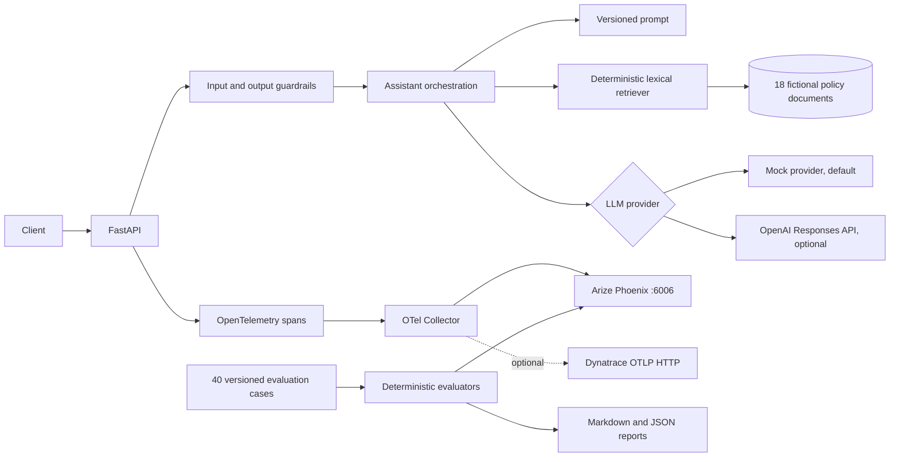

# AI Observability Lab

`ai-observability-lab` is a production-inspired personal engineering project that makes an AI support workflow observable, testable, and measurable. It implements a fictional Banking Support Assistant in Python and FastAPI, with a small local retrieval system, a deterministic mock provider, an optional OpenAI provider, OpenTelemetry traces, OpenInference semantic attributes, Arize Phoenix, evaluation annotations, prompt experiments, guardrails, and CI.

The project contains only fictional banking policies. It is not a banking system, a production security boundary, or evidence of professional use of Phoenix or Dynatrace. It demonstrates hands-on implementation patterns that can be inspected and run locally.

## Business problem

A useful answer from an AI assistant is not enough. An engineering team also needs to know which documents were retrieved, which prompt version was used, how long retrieval and model execution took, whether a response cited valid evidence, what it cost, and why a request was refused. This lab treats each answer as an observable and evaluable workflow.

## Architecture



The request trace is an HTTP server span with child spans for session, agent execution, guardrails, prompt construction, retrieval, each retrieval result, the model request, response generation, and evaluation. Attributes are allowlisted. Message content capture is disabled by default; session IDs are hashed before they become attributes.

## What is included

- `GET /health`, `POST /chat`, `POST /evaluate`, and `GET /metrics-summary`.
- 18 fictional documents and 40 evaluation cases: 20 normal, 5 ambiguous, 5 unanswerable, 5 sensitive, and 5 prompt-injection cases.
- Deterministic retrieval with explicit no-match behavior and source IDs.
- `v1` and `v2` prompts. v2 adds citation requirements, grounded refusal, and clearer treatment of untrusted instructions.
- Offline deterministic scores for answer presence, source validity, keyword coverage, refusal accuracy, guardrail compliance, latency, retrieval precision, correctness, groundedness proxy, and citation accuracy.
- Optional LLM-as-a-judge scoring for relevance, correctness, groundedness, hallucination risk, helpfulness, tone, and safety. It requires an OpenAI key and is never part of the offline CI gate.
- Failure simulation for slow responses, empty retrieval, hallucination, invalid citation, prompt injection, provider timeout, provider error, and guardrail rejection.
- Per-process bounded metrics for request count, errors, p50/p95 latency, token estimates, cost, guardrails, prompt versions, and evaluation pass rate.
- Phoenix span annotations using the current Phoenix client API.
- Optional Collector fan-out to Dynatrace over OTLP HTTP/protobuf. Dynatrace is not required for the default stack.

## Quick start

The default path uses the mock provider and needs no API key.

```bash
git clone https://github.com/EnesCkmk1/observability.git
cd observability
python -m venv .venv
source .venv/bin/activate             # Windows: .venv\Scripts\Activate.ps1
python -m pip install -r requirements-dev.lock
python -m pip install --no-deps -e .
cp .env.example .env                 # Windows: Copy-Item .env.example .env
make test
make eval
make experiment
```

Run the API without Docker:

```bash
uvicorn ai_observability_lab.api:app --reload --no-access-log
curl -X POST http://localhost:8000/chat \
  -H 'content-type: application/json' \
  -d '{"question":"How do I reset my business banking password?","session_id":"demo-session","prompt_version":"v2"}'
```

The response contains the answer, cited sources, trace ID, span ID, latency, prompt version, token counts, and whether token counts are estimates. The mock provider always works offline.

## Phoenix and the full local stack

Docker Compose starts Phoenix at [http://localhost:6006](http://localhost:6006), the Collector on `localhost:4318`, and the API on `localhost:8000`:

```bash
make phoenix
python scripts/verify_stack.py
```

Open Phoenix, select the `banking-assistant-observability` project, and inspect the trace from the verification script. The verification script sends a real evaluation request, waits for the trace, and checks that deterministic annotations are present on the agent span. The checked-in [`reports/stack-verification.json`](reports/stack-verification.json) is an example generated from that flow; its IDs and timestamp are run-specific.

The Phoenix project name is sent as the `openinference.project.name` resource attribute. The Collector forwards OTLP traces to Phoenix and uses batching, a memory limit, retry, and a bounded queue.

## Evaluation and prompt experiments

The dataset is packaged in [`src/ai_observability_lab/data/evaluation.jsonl`](src/ai_observability_lab/data/evaluation.jsonl). Run the offline gate with:

```bash
make eval
make experiment
```

The experiment runs both prompt versions against the same cases and writes [`reports/experiment-report.md`](reports/experiment-report.md) and [`reports/experiment-results.json`](reports/experiment-results.json). The generated mock run currently shows citation accuracy changing from 0.50 for v1 to 1.00 for v2. This is a test of the prompt/citation contract, not a claim about a real model. Mock token counts are whitespace estimates and mock cost is zero. Groundedness is a lexical proxy. Per-case results and a dataset SHA-256 are included so the result can be reproduced and audited.

For Phoenix's Experiments UI, start Phoenix and run `python -m ai_observability_lab.cli phoenix-experiment`. This publishes a synthetic dataset and two Phoenix experiments with code evaluators. No real customer data is used.

## Configuration

Copy `.env.example` to `.env`. Important settings are:

| Variable | Default | Purpose |
|---|---|---|
| `LLM_PROVIDER` | `mock` | `mock` or `openai` |
| `OPENAI_API_KEY` | empty | Required only for the OpenAI provider or judge |
| `OPENAI_MODEL` | `gpt-5.5` | OpenAI Responses API model |
| `CAPTURE_MESSAGE_CONTENT` | `false` | Synthetic-data-only opt-in for message attributes |
| `TELEMETRY_ENABLED` | `false` | Export application spans via OTLP HTTP |
| `OTEL_EXPORTER_OTLP_TRACES_ENDPOINT` | `http://localhost:4318/v1/traces` | Collector or Phoenix OTLP endpoint |
| `PHOENIX_ANNOTATIONS_ENABLED` | `false` | Upload deterministic scores to Phoenix |
| `DYNATRACE_ENABLED` | `false` | Enables the Dynatrace Compose overlay |
| `DYNATRACE_OTLP_ENDPOINT` | empty | HTTPS Dynatrace OTLP base URL |
| `DYNATRACE_API_TOKEN` | empty | Secret trace ingest token |

The OpenAI path uses the Responses API with `store=false`, zero retries, and a timeout. Do not commit `.env` or credentials. The app rejects OpenAI/judge configuration without a key and rejects Dynatrace configuration without an HTTPS endpoint and token.

## Dynatrace

Enable the fan-out overlay only when you have a Dynatrace tenant:

```bash
$env:DYNATRACE_ENABLED="true"       # PowerShell; use export on POSIX shells
$env:DYNATRACE_OTLP_ENDPOINT="https://YOUR_ENV.live.dynatrace.com/api/v2/otlp"
$env:DYNATRACE_API_TOKEN="..."
python scripts/compose.py up -d --build --wait
```

Use a token with the `openTelemetryTrace.ingest` scope. The Collector sends traces to both Phoenix and Dynatrace through OTLP HTTP; tokens are provided as environment variables and Collector logs run at warning level. Dynatrace dashboards can use service availability, p95 response latency, error rate, groundedness, citation accuracy, and guardrail violations as alert inputs. Suggested objectives are availability ≥99%, p95 under 3 seconds, groundedness pass rate ≥90%, citation accuracy ≥95%, and zero critical guardrail violations.

## Security and privacy

The knowledge base and dataset are fictional. The default telemetry configuration does not record raw message content, authorization headers, API keys, secrets, or personal identifiers. Input guardrails detect prompt injection, secret requests, personal customer data, and unsupported personalized financial advice. Output validation rejects unknown citations and obvious sensitive content. These are educational controls, not enterprise-complete security; production deployments need threat modeling, access control, redaction, retention policy, abuse monitoring, and provider governance.

## Testing and CI

```bash
make lint       # Ruff and mypy
make test       # 91 unit/integration/evaluator/telemetry tests
make eval       # v2 regression gate
make failures   # reports/failure-results.json
```

GitHub Actions runs Ruff, mypy, pytest, the evaluation gate, report generation, Compose validation, and a Phoenix trace/annotation smoke test. The test suite uses the mock provider and includes API, retrieval, guardrail, configuration, metrics, evaluation, and privacy-oriented telemetry checks.

## Repository map

```text
src/ai_observability_lab/   API, orchestration, providers, tracing, evaluation
src/.../data/                Fictional knowledge base and evaluation JSONL
src/.../prompts/             v1 and v2 prompt templates
config/                      Local and Dynatrace Collector configurations
scripts/                     Compose launcher and end-to-end stack verification
tests/                       91 automated tests
reports/                     Generated deterministic experiment and smoke-test evidence
```

## Limitations and future improvements

The retriever is lexical and intentionally small, metrics are process-local, and the mock provider cannot represent semantic LLM behavior. A production version would add embeddings with a privacy-reviewed store, durable metrics, trace sampling and retention controls, stronger redaction, load tests, authenticated Phoenix access, richer semantic evaluators, and model-specific cost catalogs. The optional judge is deliberately separate from CI so external model drift cannot silently change the deterministic gate.

## Skills demonstrated

AI/LLM observability · distributed tracing · OpenTelemetry and OTLP · OpenInference · Arize Phoenix · Dynatrace telemetry integration · LLM evaluation · RAG evaluation · LLM-as-a-judge · prompt versioning · dataset-driven experiments · guardrails · regression testing · FastAPI · Docker · CI/CD.

## Portfolio wording

Suggested GitHub description: **Production-inspired AI observability lab: a traced and evaluated fictional banking RAG assistant with OpenTelemetry, Phoenix, prompt experiments, guardrails, and optional Dynatrace fan-out.**

Suggested topics: `ai-observability`, `llm-observability`, `opentelemetry`, `openinference`, `arize-phoenix`, `rag-evaluation`, `llm-evaluation`, `fastapi`, `python`, `docker`, `dynatrace`, `ai-engineering`.

Suggested CV wording: **Built a production-inspired Python/FastAPI banking-support RAG lab with OpenTelemetry/OpenInference tracing, Phoenix span annotations, deterministic RAG and guardrail evaluations, prompt-version experiments, failure simulation, and optional Dynatrace OTLP fan-out; added 91-test CI and reproducible mock-provider reports.**

Suggested LinkedIn wording: **Personal engineering project exploring how to make LLM applications measurable: trace every retrieval and model step, evaluate groundedness and citations, compare prompt versions, simulate failure modes, and export OpenTelemetry telemetry to Phoenix or Dynatrace.**

## Screenshots

Screenshots are intentionally left as placeholders until a maintainer captures their own Phoenix workspace and local API flow. Recommended captures are: the trace waterfall, retrieval and LLM span attributes, evaluation annotations, and the prompt experiment comparison.
